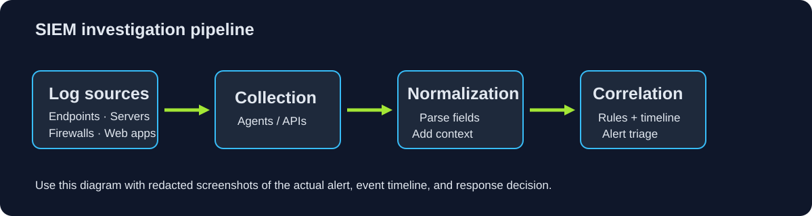
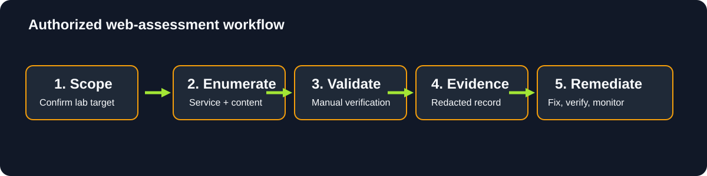

# CTF & TryHackMe Writeups

This repository demonstrates structured investigation methodology, defensive thinking, and evidence discipline for authorized security labs. It contains original, non-spoiler material suitable for a public portfolio.

> Scope: all offensive examples are limited to TryHackMe-provided, intentionally vulnerable training targets. Do not reuse commands against systems without explicit authorization.

## Contents

| Guide | Focus |
| --- | --- |
| [Public-writeup policy](tryhackme/active-content-policy.md) | How active TryHackMe content is handled in this repository |
| [Packet Analysis Playbook](packet-analysis/ettercap-and-wireshark.md) | Ethical packet capture and analysis workflow |

## Repository conventions

- `tryhackme/` contains public-sharing guidance; active room solutions stay private.
- `packet-analysis/` contains reusable packet-analysis methodology.
- `assets/` is reserved for redacted screenshots captured during future lab runs.





No screenshots from training platforms are included. Add only original, authorized, redacted evidence from your own labs; never include flags, answers, solutions, target addresses, tokens, or session material.

## Recommended evidence format

```text
assets/<room-slug>/01-<short-description>.png
```

Then embed it with descriptive alt text:

```md

```

## Reading the material

Clone the repository and open the linked Markdown guides in a text or Markdown viewer. No service, package installation, or attack execution is needed to read the material. Follow each platform’s current sharing rules before adding new evidence.

## Repository map

```text
ctf-tryhackme-writeups/
|-- .gitignore
|-- LICENSE
|-- README.md
|-- SECURITY.md
|-- assets/
|-- packet-analysis/
`-- tryhackme/
```

Follow the setup and safety boundaries above before running or deploying any code.
